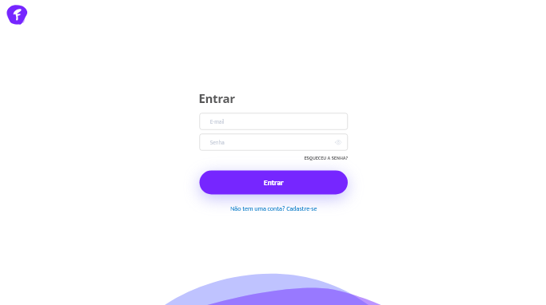
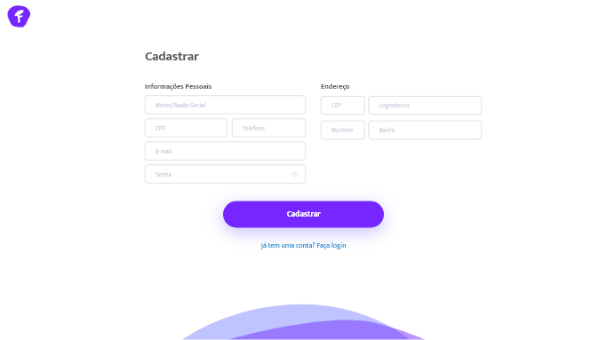
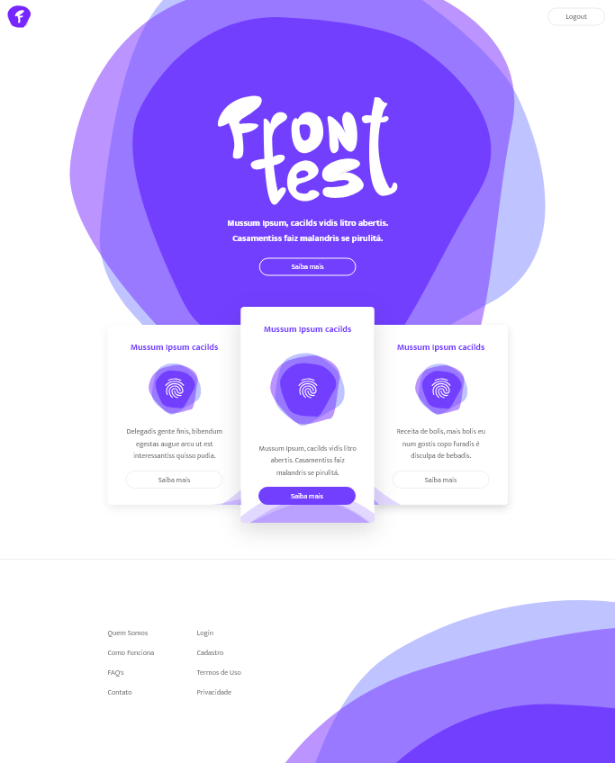

<p align="center">
  
</p>

# Front-end Teste - Praxio

O objetivo deste desafio é podermos avaliar seus conhecimentos técnicos independente do nível que estiver, não é obrigatório entregar o projeto todo, mas sim até onde consegue ir :wink:

## A missão

Sua missão é implementar uma SPA (_Single Page Application_) seguindo as recomendações abaixo:

### Layout

Este é o layout que deverá ser desenvolvido:

#### Login


#### Cadastro


#### Home


E aqui os links do layout:

- [Navegação](https://goo.gl/cWJKSp)
- [Spec](https://goo.gl/im38RL)
- [Imagens](https://drive.google.com/open?id=1rSgOzsJRWx7zKwFgdFY6Md147XoSPSpi)

### Requisitos

- O uso do framework Angular 2+ é obrigatório
- O layout deve ser implementado de acordo com as especificações do Spec
- É obrigatório o uso de rotas
- O uso de máscaras nos campos CEP, Telefone, CPF é obrigatório
- A validação do campo e-mail é obrigatória
- Todos os campos do cadastro serão obrigatórios
- A aplicação deve funcionar nos navegadores mais recentes do mercado

### API

Para a integração você deverá utilizar a seguinte [API](https://processoseletivo.azurewebsites.net/swagger/index.html)

### Endpoints

#### Cadastro:
```
POST /api/Usuario
```

#### Login:
```
POST /api/Authorization/RequestToken
```

## O que iremos avaliar

- ***Organização do projeto***: Avaliar a estrutura do projeto, documentação e uso de controle de versão
- ***Inovação tecnológica***: Avaliar o uso de tecnologias mais recentes, desde que estáveis
- ***Boas práticas***: Avaliar se o projeto segue boas práticas de desenvolvimento, incluindo segurança e otimização

## Chegou a hora de entregar :tada:

Agora é só disponibilizar seu código num repositório **público** ou **privado** no seu Github pessoal, envie o link para vemprotime@praxio.com.br ou faça um `pull-request`. Você tem até 7 dias após a sua aplicação na vaga pelo [site](https://jobs.kenoby.com/praxio).

## Dúvidas

Se tiver alguma dúvida é só nos enviar pelo e-mail vemprotime@praxio.com.br ou abrindo uma issue :grimacing:
